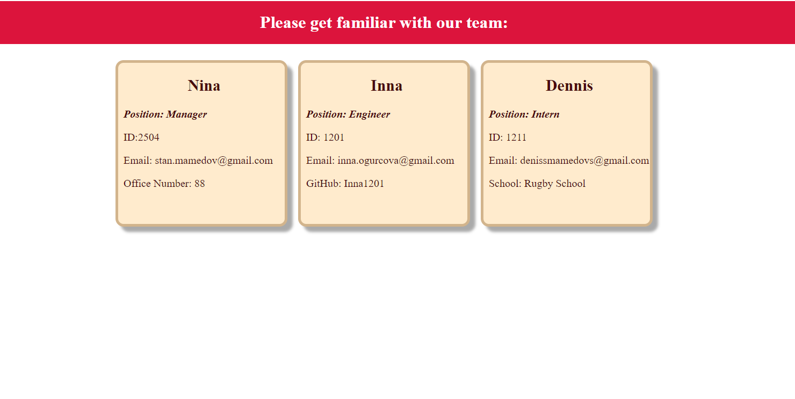

# Team-Profile-Generator-Inna-s-OOP-Challenge
My name is Inna Mamedova, I am a student of Birmingham University Coding Bootcamp.
In this challenge I have created a Team Profile Generator.

# Project requirements
Create a Node.js command-line application that takes in information about employees on a software engineering team, then generates an HTML webpage, and write a unit test for every part of your code and ensure that it passes each test.

# Details
I have installed an Inquirer and Jest packages.
I have used prompts to choose a team member by the the role and to create acoording questions.
I have used html template to create necessay structure of the page and used CSS to add styling.
I have intergrated html template into .js file to aoutogenerate good formated Team Profile application. 
I have wrote a unit test and thested them to ensure that all got pass status.

# Screenshot

# Link
[Web page](https://drive.google.com/file/d/1KamomZO3r2FkFmTXPROPtWZTVmuM8Jqg/view)