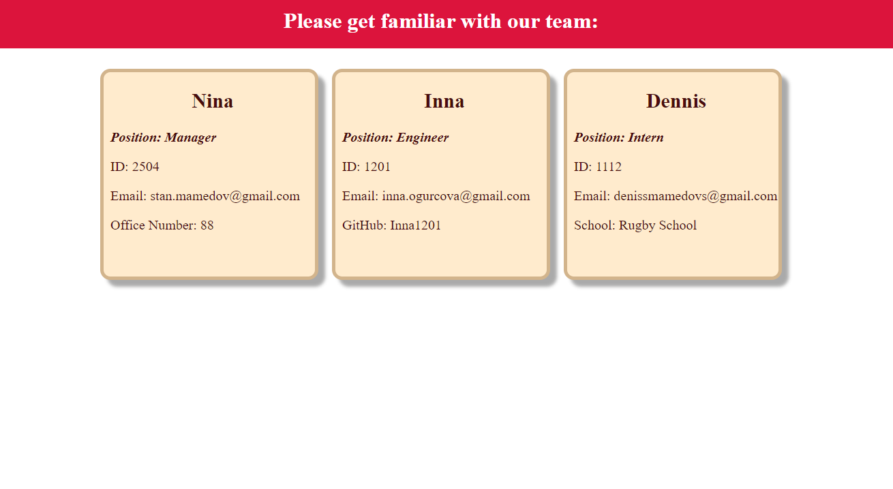

# Team-Profile-Generator-Inna-s-OOP-Challenge
My name is Inna Mamedova, I am a student of Birmingham University Coding Bootcamp.
In this challenge I have created a Team Profile Generator.

# Project requirements
Create a Node.js command-line application that takes in information about employees on a software engineering team, then generates an HTML webpage, and write a unit test for every part of your code and ensure that it passes each test.

# Details

# Screenshot

# Link
[Web page](https://drive.google.com/file/d/1wdJO83BEPfwjqXM4-47Md614JGapFT64/view)